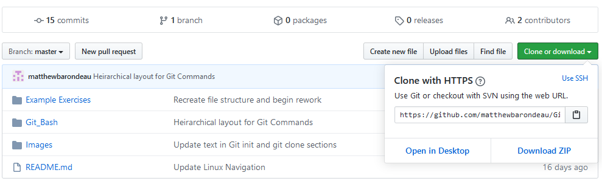
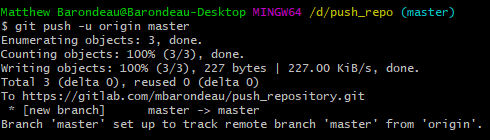
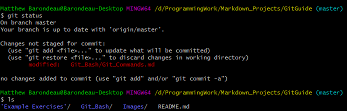
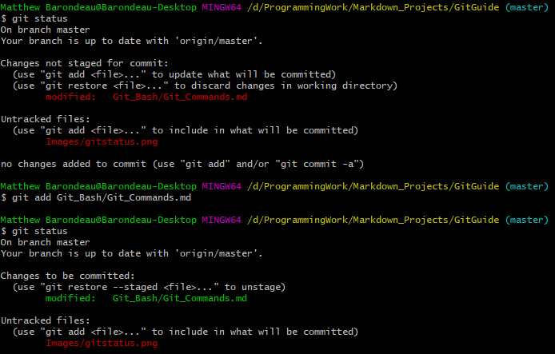
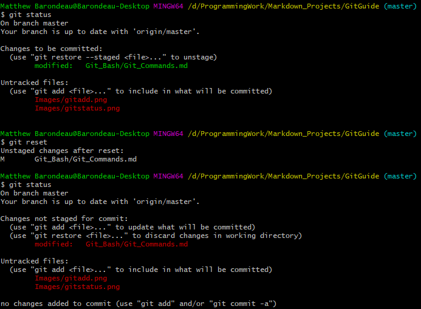

## Using Git

### Creating and Initializing a git repository
To start using git, we need to setup a git repository. The first step, is lets make a repository on GitHub itself. To do this in EE319k, you can accept the link that the TAs send out for the GitHub classroom. For the sake of completeness however, I will walk you through how to setup your own repository.

When you first open up GitHub, go to the top left of your screen. There will be a small green box that says "new". Click this box. A new window will pop up with options for the repository. You are required to select a repository name, what you want the repository to be called, and choose if the repository is public or private. A public repository can be seen by anyone coming to your GitHub page, so it is best to not put class projects in a public repository. Private repositories means that only you and people you select can make changes to this repository.

Once you have decided on a name and type of repository, select create repository to create a new blank repository. The next step in our process is to connect this remote repository with a local directory on your computer. There are two ways to do this which are discussed below.

#### git clone
The first idea covered here is cloning. That is, making a local copy of a repository that is stored up on GitHub or GitLab. To start, you need to have a repository on GitHub or GitLab, and grab the HTTPS link. You need this link so that you can safely copy the code onto your machine. An example of where to find the https link is shown below.

  

Once you have the HTTPS link, its time to pick a location locally that you want to put the repository. In the example below, I navigate to the folder I want to put the repository. I then type "git clone" followed by the https link described above. In this example, I am just cloning the repository that contains my git guide.

  

In this way, I can clone an existing repository to a local directory. This can be useful when there is existing code in a repository, but if you have local code or a project that you wish to be associated with a repository, such as in EE319k, the second approach would most likely be to your benefit.

#### git init
The concept of making a local directory a git repository and then pushing it to a hosting platform like GitHub and GitLab is covered here. The first step, is to navigate to the directory that contains the files and folders you want to be hosted. Then, type the command "git init" which will initialize git for the given directory. Once you have initialized the repository, you will need to perform a commit of all the files you want to push up to GitHub or GitLab. The commit process is covered in more depth down below, so if you have never performed a commit, I encourage you to keep reading down to further your understanding.

  

Once you know how to perform a commit, select the files that you want to push up and commit them. It is normally good form to have the first commit of your files to be called "Initial Commit". Once you have your first commit, you will need to specify where the remote repository should be. Otherwise, how will git know where to push files? To specify this remote location, the command is "git remote add origin https" where the https is the HTTPS link for your repository.

  

Once you have set the remote location as shown above, it is time to push your files up to the GitHub or GitLab. To do this, you will type "git push -u origin master". This pushes upstream to the remote repository labeled origin and on the master branch.

  

In case you want the simple short version, the exact sequence you will need to start, for instance, and Keilv5 project for EE319k is shown below.

TODO EE319k Shortcut Init

### Creating a Commit

#### git status
The power of git is that you can track changes in code over time. One key aspect to this, is being able to see what in the code has changed since the last commit. So, lets examine how you would see what has changed. First, let me explain the concept of tracking. Git only keeps track of things that you have told it are important. Otherwise, it doesn't care about the other files, it just says that they are untracked. A file starts being tracked anytime you add it to a commit. Anyway, that blurb will be important later.

For now, lets just assume that everything in the repository is tracked. That is, you told git that you care about all the files. To figure out the status of the files that you are tracking, type "git status". An example git status is shown below. Let me walk you through it.

  

In this window, I see that there are some files listed. If I do a "ls" we can see that these are not all the files in the directory. Rather, these are the files that have been modified since the last commit. Keep these files in mind as these are the files we can later add to a commit. Anytime you want to see what has changed, simply do a "git status".

#### git add
Once you have cloned the repository, you can create your files or move them into this repository. At this point however, git is not tracking them. To tell git to begin tracking files, I will use the "git add filename" command. This command will add any file I name to the staging area that I mentioned earlier. If I want to add every file in the repository, I can use "git add ."

An example of git add is shown below:

  

Notice how the text turned green. The green text indicates that the file has been 'staged'. All files that are currently staged will be added to the next commit. You can remove any file from the staging area using the "git reset" command.

#### git reset
Now I get to come to the fun part of git. What happens when you make a mistake? Luckily, git provides three options for erasing your mistakes. These three options are all options for the git reset command. They are the hard, soft, and mixed. I will cover mixed and hard reset here as I find them the most useful.

First I will cover the soft reset. This reset is useful because it will modify anything that we have added, but not yet committed yet, while leaving the local files the same. An example of this is if I stage a file but later change my mind about adding it this commit I can use the reset. If I type “git reset” git will reset everything in the staging area to my most recent commit.

  

The other type of reset is useful whenever you have really messed up and need to start from a point where you know your code worked. Be careful before you execute this command as it will wipe out any modifications to files you have made since that commit. The syntax is similar to the mixed reset. Now I have an example of reset down below, but I need to explain HEAD. This is a shorthand for the most recent commit. By saying "git reset --hard HEAD", I am removing all changes to my file since the last commit.

#### git commit
Alright, now we have finally reached the commit. Once we have added an item into the staging area using git add, we need to permanently save our changes. This is the commit process. The syntax is "git commit" which will commit everything in the staging area.

Now you will need to give a commit message describing what that commit changed. There are two ways to do this. The first is to use the commit command above and then a new window will pop up and you can type your message. Alternatively, you can use "git commit -m " and then type the message after the -m. An example is shown below.

### Keeping track of your code

#### git log
Now that you have gone through the process of committing, you need to track your commits. The easiest way to do this is by using the log functionality. The syntax for this is "git log"
which will pull up the log. An example is shown below.

Here you can see the commit followed by an alphanumeric string. This string is the unique identifier for that commit. If you want to work with that commit in the future, use that string. Additionally, you can see the author, when it was committed and what the commit did.

#### git diff
Now that you have created some commits and viewed the log, it may be beneficial to find what changed between commits. Or more commonly, what your partner changed in their commits. This can be done using the diff command as shown below.

Shown in the example diff, where the removed text is in red and the new additions are green. You can also see new file additions using this command.

### Synchronizing between computers

#### git pull
When coding in groups, you will need to keep track of changes made by other people and merge them into your own code. The first step in this process is pulling the code down to your computer from a repository. Before you pull any code, you need to make sure it is code that you want to fold into your system, and that any changes you made are either already saved or they don't matter.

If you want to save your code, refer to git stash as a way to temporarily store your changes. If there are changes that you don't want, refer to the git reset section on how to erase these changes. In either case, once you have decided your repository is ready to fold in some new information, you will use the "git pull" command. Note that this pulls from the online repository that you are connected to by default. If you want to pull from elsewhere, you will need to specify.

Here is an example of me pulling an update from GitHub:

#### git push
Once you have made changes in your local repository, you can push this changes up to GitHub so that your partner can see your changes and so that if your laptop crashes, you have a backup of your code. As a reminder, git push comes after you have added a new commit. If you have not added a new commit, then you won't be able to push anything.

First, you should make sure that your local branch is up to date, this is done through the git pull command shown above. If your local repository is not up to date, git will not know what to do and you will get an error. After you have checked that your local repository is up to date, you will use the command "git push" and if you want a destination after it. This destination will be useful if you are working with branches as described below. For now, here is a screenshot depicting a successful push.

### Branches

#### git branch
Git provides a feature that is useful for adding new features to code called a branch. If you are working on part of a project that has many disjoint parts, it may be useful to work on them separately and then merge them all together as they are completed. While this may be more useful as you work with larger projects, the concept is still worthwhile to go over. You can think of a branch as a separate sequence of commits that you will later merge back into your main master branch.

To begin, let me show you how to list out the branches. You can do this by typing "git branch" which will display all the current branches in your repository. An example is shown below:

In this example above, I use git branch to display the list of current branches. If I want to create a new branch however, you need to be aware of 1 thing. The new branch I am creating will be a copy of the source branch, so if you want to modify your main program, make sure you are on the master branch when you create your new branch. In the example above, I use "git branch branchname" to create a new branch that is a copy of whatever branch I was on to begin this. This branch is denoted by green text. Now that you know what a branch is, I will describe how to change branches below using git checkout.

#### git checkout
Git checkout is the method by which a git user can select which branch they want to work on. The syntax is quite simplistic, as all you need to do is "git checkout branchname". Before you switch however, you need to make sure that your working directory is clean and that you don't have anything in your staging area that isn't committed. If you do not do this, git cannot switch and you shall get an error.

### What happens when something goes wrong

#### git blame
Ever been in a situation with a lab partner and you want to know whose fault a particular bug is? Luckily git thought ahead and there is a built in mechanism for assigning blame. This tool, called git blame, will go through a file and show who modified each line. An example of git blame is shown below. Additionally, on the far left, git blame will tell you the last commit that changed that line.

#### git stash
The final git feature that I will talk about is the git stash. Git stash is useful if you want to make a commit, but there is some file or change that is preventing you from committing, and you really care about that file or change. Git stash is a temporary storage area that you can write to and read from as you want. For more information, consult git documentation.
