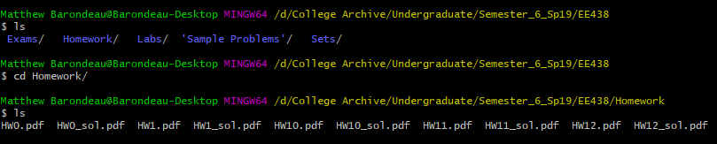
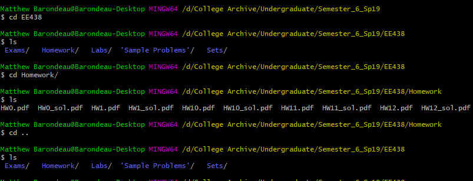
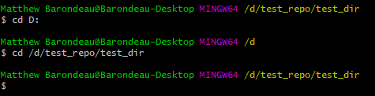
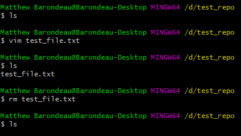
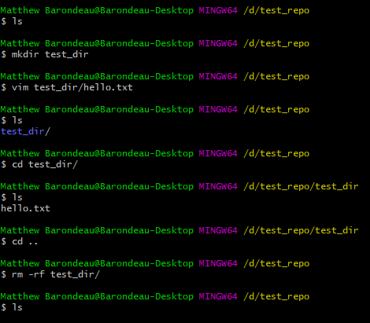

# Bash Navigation
This document shall detail how to navigate the git bash terminal.

## Finding out where you are
We will first start by learning how to navigate through this shell. To start, we should find out where we are. This can be done by typing “ls” into the window and pressing enter.  This should bring up all the directories or folders inside of our current folder. It should look something like the image below. In this example, I am inside my EE438 folder and I type ls. This shows me that there are 5 other directories inside this folder. I know this because in this shell, directories are shown in blue. I can look inside the homework folder and do another ls, which shows me what files are inside this directory.

## Changing Directories
Now that you have listed out your current directory, lets begin moving around and changing directories. If we want to change directories, we can use the “cd” command. The cd command works on both relative and absolute paths. An example of a relative path is shown above. In this example, I am in my EE438 directory and I want to navigate to my Homework directory. I can type the name of the directory I want to navigate to, and so long as it is within my current directory, I can change to it.

One particularly useful case of relative directory navigation is "cd ..". In Linux file systems, ".." refers to the parent directory, or the directory that contains the current directory you are in. So continuing my previous example, if I am in my homework directory, I can type "cd .." to get back to the EE438 directory. This exact sequence is shown below.

Now on to absolute paths. If you know exactly where you want to navigate to, you can use an absolute path. The absolute path consists of the full location of the directory. In the example shown below, my test_repo is located in /d/test_repo, so I could use the full name of the test_dir to navigate to it. I would type cd /d/test_repo/test_dir to nagivate to the directory.

## Creating Directories
Finally, you will want to create a new folder to work with. Navigate to the location that you want to work with and type “mkdir foldername”. This will create a new folder that you can navigate into and work with. Below is an example of a directory before and after a mkdir instruction. In this example, I have no directories inside my "test_repo" directory. I used the mkdir command to create two new test directories. Then, just to prove these are directories, I navigate inside test_dir2.

## Removing Files
In the event that you create a document that you want to remove, there is a handy command to delete it. To remove a file, type "rm filename" where filename is the name of the file you wish to remove. An example of this is shown below. In this example I show that the repository is empty, I then create a file called test_file.txt. I then remove the test file.

## Removing Directories
If you want to remove a folder, you can use "rm -rf dirname" to remove a full directory. The -r is a recursive flag meaning it will go and delete everything in the folder, so as usual, be careful when deleting stuff. An example of this command is shown below. In this example, I create a directory called test_dir. Then to be more realistic, I create a file called hello.txt inside that directory. By using "rm -rf" on the test_dir, I remove both the hello.txt file as well as the test_dir directory.

