# Electrical Engineering Git Guide

## Table of Contents
<!-- TOC -->
- [GIT Background](#git-background)
  - [Introduction to Git](#Introduction-to-Git)
- [Git Bash](#git-bash)
  - [Navigating a bash shell](#navigating-a-bash-shell)
    -[Finding out where you are](#finding-out-where-you-are)
    -[Changing Directories](#Changing-Directories)
    -[Creating Directories](#Creating-Directories)
    -[Removing Files](#Removing-Files)
    -[Removing Directories](#Removing-Directories)
  - [Git Commands](#git-commands)
    -[Creating a repository](#creating-a-git-repository)
    -[Creating a commit](#creating-a-commit)
    -[Keeping track of your commits](#keeping-track-of-your-commits)
    -[Synchronizing between computers](#Synchronizing-between-computers)
- [GitHub Desktop](#GitHub-Desktop)
- [Use with Keil](#use-with-keil)
  - [Importing files to Keil Project](#importing-files-to-keil-project)
  - [Files that need to be shared between computers](#files-that-need-to-be-shared-between-computers)

<!-- /TOC -->

## Git Background

### Introduction to Git
A version control language is a tool that tracks changes to files and provides users a way to review past changes. There are several version control tools available to you for free, but in EE306 and EE319k we will primarily use Git. Git has two large online repositories that grant free accounts, GitLab and GitHub, but we shall primarily use GitHub.

A version control language tracks the status of a directory and can create specific save spots. The user can choose which changes to save and come back to. In programming, we can use version control languages to save points where significant progress in code has been made.

Git was invented by Linus Torvalds. In the years since, it has become a popular tool for programmers and a valuable teaching tool. Git works by keeping track of changes in a repository, with the most recent version called the HEAD. This head is normally what the programmer is currently working on.  

Git works by having a staging area, a working area, and a series of saved commits. First, let me describe the working area. The working area is the files that you are working on. Think of this as the files that appear and that you can change. Git can see all the changes in this working area, but you have to tell git to care about certain files and save their state. This saving process is two fold. First, you need to move the files you care about to a staging area. Then, once you have everything you want to save there, you perform a commit. The commit will move everything in your staging area into the saved commit. In this way, you can create save points in your code as you work.

## Git Bash

### Navigating a bash shell
#### Finding out where you are
We will first start by learning how to navigate through this shell. To start, we should find out where we are. This can be done by typing “ls” into the window and pressing enter.  This should bring up all the directories or folders inside of our current folder. It should look something like the image below. In this example, I am inside my EE438 folder and I type ls. This shows me that there are 5 other directories inside this folder. I know this because in this shell, directories are shown in blue. I can look inside the homework folder and do another ls, which shows me what files are inside this directory.

  

#### Changing Directories
Now that you have listed out your current directory, lets begin moving around and changing directories. If we want to change directories, we can use the “cd” command. The cd command works on both relative and absolute paths. An example of a relative path is shown above. In this example, I am in my EE438 directory and I want to navigate to my Homework directory. I can type the name of the directory I want to navigate to, and so long as it is within my current directory, I can change to it.

One particularly useful case of relative directory navigation is "cd ..". In Linux file systems, ".." refers to the parent directory, or the directory that contains the current directory you are in. So continuing my previous example, if I am in my homework directory, I can type "cd .." to get back to the EE438 directory. This exact sequence is shown below.

  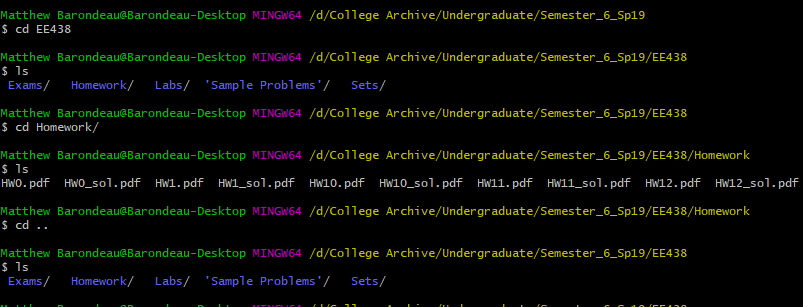

Now on to absolute paths. If you know exactly where you want to navigate to, you can use an absolute path. The absolute path consists of the full location of the directory. In the example shown below, my test_repo is located in /d/test_repo, so I could use the full name of the test_dir to navigate to it. I would type cd /d/test_repo/test_dir to nagivate to the directory.

  

#### Creating Directories
Finally, you will want to create a new folder to work with. Navigate to the location that you want to work with and type “mkdir foldername”. This will create a new folder that you can navigate into and work with. Below is an example of a directory before and after a mkdir instruction. In this example, I have no directories inside my "test_repo" directory. I used the mkdir command to create two new test directories. Then, just to prove these are directories, I navigate inside test_dir2.

  

#### Removing Files
In the event that you create a document that you want to remove, there is a handy command to delete it. To remove a file, type "rm filename" where filename is the name of the file you wish to remove. An example of this is shown below. In this example I show that the repository is empty, I then create a file called test_file.txt. I then remove the test file.

  

#### Removing Directories
If you want to remove a folder, you can use "rm -rf dirname" to remove a full directory. The -r is a recursive flag meaning it will go and delete everything in the folder, so as usual, be careful when deleting stuff. An example of this command is shown below. In this example, I create a directory called test_dir. Then to be more realistic, I create a file called hello.txt inside that directory. By using "rm -rf" on the test_dir, I remove both the hello.txt file as well as the test_dir directory.

  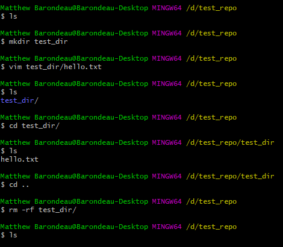

### Git commands
#### Creating a git repository
To start using git, we need to setup a git repository. The first step, is lets make a repository on GitHub itself. To do this in EE319k, you can accept the link that the TAs send out for the GitHub classroom. For the sake of completeness however, I will walk you through how to setup your own repository.

When you first open up GitHub, go to the top left of your screen. There will be a small green box that says "new". Click this box. A new window will pop up with options for the repository. You are required to select a repository name, what you want the repository to be called, and choose if the repository is public or private. A public repository can be seen by anyone coming to your GitHub page, so it is best to not put class projects in a public repository. Private repositories means that only you and people you select can make changes to this repository.

Once you have decided on a name and type of repository, select create repository to create a new blank repository. The next step in our process is to connect this remote repository with a local directory on your computer. There are two ways to do this which are discussed below.

##### git clone
The first idea covered here is cloning. That is, making a local copy of a repository that is stored up on GitHub or GitLab. To start, you need to have a repository on GitHub or GitLab, and grab the HTTPS link. You need this link so that you can safely copy the code onto your machine. An example of where to find the https link is shown below.

  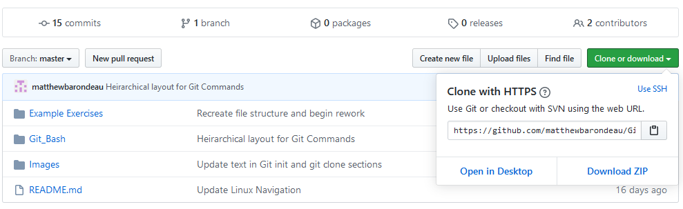

Once you have the HTTPS link, its time to pick a location locally that you want to put the repository. In the example below, I navigate to the folder I want to put the repository. I then type "git clone" followed by the https link described above. In this example, I am just cloning the repository that contains my git guide.

  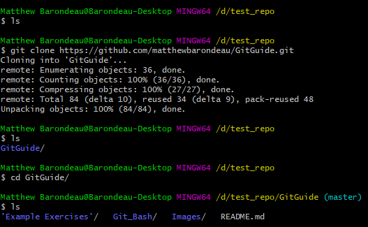

In this way, I can clone an existing repository to a local directory. This can be useful when there is existing code in a repository, but if you have local code or a project that you wish to be associated with a repository, such as in EE319k, the second approach would most likely be to your benefit.

##### git init
The concept of making a local directory a git repository and then pushing it to a hosting platform like GitHub and GitLab is covered here. The first step, is to navigate to the directory that contains the files and folders you want to be hosted. Then, type the command "git init" which will initialize git for the given directory. Once you have initialized the repository, you will need to perform a commit of all the files you want to push up to GitHub or GitLab. The commit process is covered in more depth down below, so if you have never performed a commit, I encourage you to keep reading down to further your understanding.

  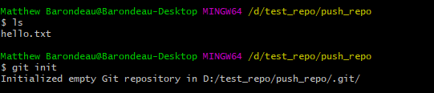

Once you know how to perform a commit, select the files that you want to push up and commit them. It is normally good form to have the first commit of your files to be called "Initial Commit". Once you have your first commit, you will need to specify where the remote repository should be. Otherwise, how will git know where to push files? To specify this remote location, the command is "git remote add origin https" where the https is the HTTPS link for your repository.

  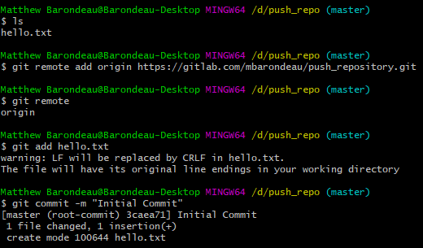

Once you have set the remote location as shown above, it is time to push your files up to the GitHub or GitLab. To do this, you will type "git push -u origin master". This pushes upstream to the remote repository labeled origin and on the master branch.

  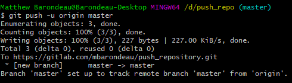

#### Creating a Commit

##### git status
The power of git is that you can track changes in code over time. One key aspect to this, is being able to see what in the code has changed since the last commit. So, lets examine how you would see what has changed. First, let me explain the concept of tracking. Git only keeps track of things that you have told it are important. Otherwise, it doesn't care about the other files, it just says that they are untracked. A file starts being tracked anytime you add it to a commit. Anyway, that blurb will be important later.

For now, lets just assume that everything in the repository is tracked. That is, you told git that you care about all the files. To figure out the status of the files that you are tracking, type "git status". An example git status is shown below. Let me walk you through it.

  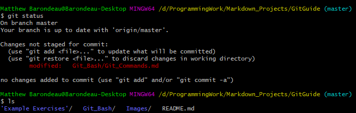

In this window, I see that there are some files listed. If I do a "ls" we can see that these are not all the files in the directory. Rather, these are the files that have been modified since the last commit. Keep these files in mind as these are the files we can later add to a commit. Anytime you want to see what has changed, simply do a "git status".

##### git add
Once you have cloned the repository, you can create your files or move them into this repository. At this point however, git is not tracking them. To tell git to begin tracking files, I will use the "git add filename" command. This command will add any file I name to the staging area that I mentioned earlier. If I want to add every file in the repository, I can use "git add ."

An example of git add is shown below:

  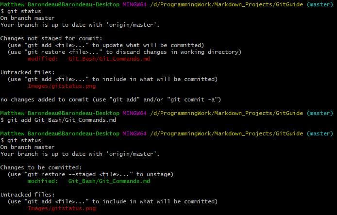

Notice how the text turned green. The green text indicates that the file has been 'staged'. All files that are currently staged will be added to the next commit. You can remove any file from the staging area using the "git reset" command.

##### git reset
Now I get to come to the fun part of git. What happens when you make a mistake? Luckily, git provides three options for erasing your mistakes. These three options are all options for the git reset command. They are the hard, soft, and mixed. I will cover mixed and hard reset here as I find them the most useful.

First I will cover the soft reset. This reset is useful because it will modify anything that we have added, but not yet committed yet, while leaving the local files the same. An example of this is if I stage a file but later change my mind about adding it this commit I can use the reset. If I type “git reset” git will reset everything in the staging area to my most recent commit.

  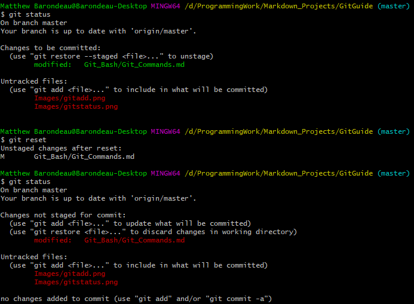

The other type of reset is useful whenever you have really messed up and need to start from a point where you know your code worked. Be careful before you execute this command as it will wipe out any modifications to files you have made since that commit. The syntax is similar to the mixed reset. Now I have an example of reset down below, but I need to explain HEAD. This is a shorthand for the most recent commit. By saying "git reset --hard HEAD", I am removing all changes to my file since the last commit.

  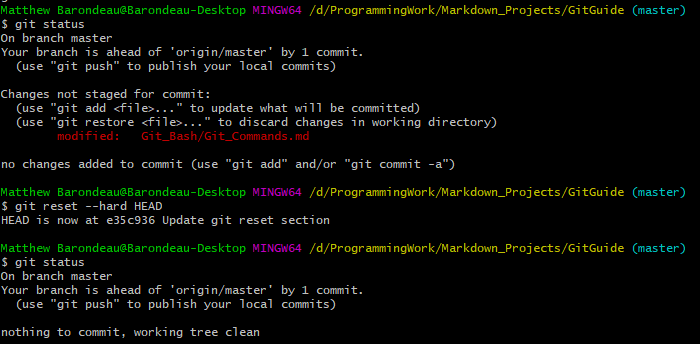

##### git commit
Alright, now we have finally reached the commit. Once we have added an item into the staging area using git add, we need to permanently save our changes. This is the commit process. The syntax is "git commit" which will commit everything in the staging area.

Now you will need to give a commit message describing what that commit changed. There are two ways to do this. The first is to use the commit command above and then a new window will pop up and you can type your message. Alternatively, you can use "git commit -m " and then type the message after the -m. An example is shown below.

  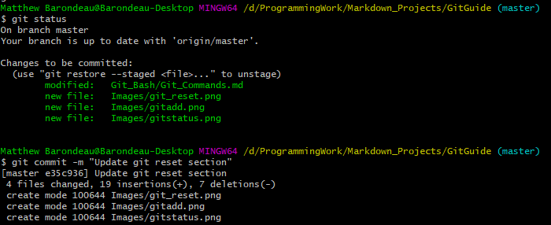

#### Keeping track of your commits

##### git log
So there are two options for seeing what your previous commits were. Once the commits are pushed up to GitHub or GitLab, you can use the GUI to figure out what the commits each did and what lines of code they change. Alternatively, you can use the log functionality built directly into git bash. To pull up the log, the command is "git log", and an example is shown below. One important thing to note before you pull up the log: press the 'q' key to quit out of the log.

  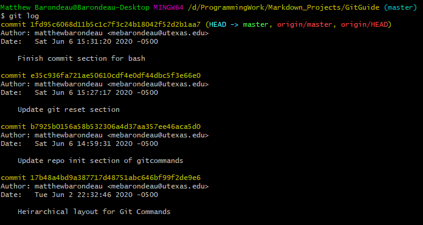

Here you can see the commit followed by an alphanumeric string. This string is the unique identifier for that commit. If you want to work with that commit in the future, use that string. For example, if you want to reset to a particular commit, you can use "git commit --hard e35c936" to reset to that particular commit.

##### git diff
Now that you have created some commits and viewed the log, it may be beneficial to find what changed between commits. Or more commonly, what your partner changed in their commits. To view the difference, the command is "git diff" if you want to see all changes. You can also use "git diff filename" to see the changes in one particular file. Shown below is an example diff, where the removed text is in red and the new additions are green. You can also see new file additions using this command.

  

#### Synchronizing between computers

##### git pull
When coding in groups, you will need to keep track of changes made by other people and merge them into your own code. The first step in this process is pulling the code down to your computer from a repository. Before you pull any code, you need to make sure it is code that you want to fold into your system, and that any changes you made are either already saved or they don't matter.

If you want to save your code, you can either create a commit or use a stash functionality not covered in this guide. If there are changes that you don't want, refer to the git reset section on how to erase these changes. In either case, once you have decided your repository is ready to fold in some new information, you will use the "git pull" command. Note that this pulls from the online repository that you are connected to by default. If you want to pull from elsewhere, you will need to specify.

Here is an example of me pulling an update from GitHub:

  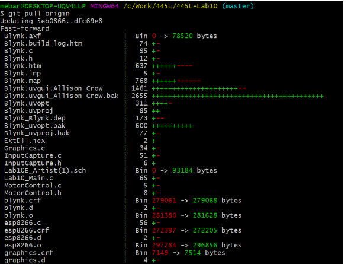

In this example, the green + symbols incidate the number of lines added to that file. Similarly, the red - indicate the number of lines deleted from those files. Anything that goes from 0 to some number of bytes indicates a file that was created in the commits that you pulled. Note that pulling is different than cloning because in a pull, there is the assumption that the repository is already set up and only has to have a few files updated in order to match the online version.

##### git push
Once you have made changes in your local repository, you can push this changes up to GitHub so that your partner can see your changes and so that if your laptop crashes, you have a backup of your code. As a reminder, git push comes after you have added a new commit. If you have not added a new commit, then you won't be able to push anything.

First, you should make sure that your local branch is up to date, this is done through the git pull command shown above. If your local repository is not up to date, git will not know what to do and you will get an error. After you have checked that your local repository is up to date, you will use the command "git push" and if you want a destination after it. This destination will be useful if you are working with branches as described below. Shown below is a screenshot of git push.

  

##### Overview
Git bash is a bash shell that you can download to do all your git commits. This is the approach I recommend that you take to using git. It allows much more control over the commit process and allows you to become more familiar with the bash shell in general. To start, you need to download Git Bash onto your machine. The link to find Git Bash is here: https://git-scm.com/downloads

## GitHub Desktop

## Use with Keil
This section shall describe how to use git specifically with Keil projects. There will also be a section in which I show the process for adding files between Keil users and pulling them down.

### Example
First, I am going to create a repository on GitHub for my first assignment. Then I am going to push the folder containing my project up to GitHub.

Now, I am going to make several changes and add a few files. The git log below shows my changes but if I wanted a more in depth view I could use git diff with the two commit ID's. An example here would be "git diff 304c667 cf4daa".

From here, I am going to pull this project onto a different computer. With Keil 5, you should be able to see any new files added to the project. If that is not the case, you can manually add them as shown below:

