<!-- TOC -->

- [Electrical Engineering Git Tutorial](#electrical-engineering-git-tutorial)
  - [GIT Background](#git-background)
    - [Introduction to Version Control Languages](#introduction-to-version-control-languages)
    - [Git Background](#git-background)
  - [Git Bash](#git-bash)
    - [Linux Navigation](#linux-navigation)
      - [Finding out where you are](#finding-out-where-you-are)
      - [Changing Directories](#changing-directories)
      - [Creating Directories](#creating-directories)
      - [Removing Directories](#removing-directories)
    - [Git commands](#git-commands)
      - [git clone](#git-clone)
      - [git status](#git-status)
      - [git add](#git-add)
      - [git commit](#git-commit)
      - [git log](#git-log)
      - [git diff](#git-diff)
      - [git pull](#git-pull)
      - [git push](#git-push)
      - [git branch](#git-branch)
      - [git checkout](#git-checkout)
      - [git reset](#git-reset)
      - [git blame](#git-blame)
      - [git stash](#git-stash)
  - [Use with Keil](#use-with-keil)
    - [Importing files to Keil Project](#importing-files-to-keil-project)
    - [Files that need to be shared between computers](#files-that-need-to-be-shared-between-computers)
  - [Practice Exercises](#practice-exercises)
    - [Basic Git Exercises](#basic-git-exercises)
      - [Exercise 1](#exercise-1)
      - [Exercise 2](#exercise-2)
      - [Exercise 3](#exercise-3)
    - [Intermediate Git Exercises](#intermediate-git-exercises)
      - [Exercise 1](#exercise-1-1)
      - [Exercise 2](#exercise-2-1)
      - [Exercise 3](#exercise-3-1)
    - [Advanced Git Exercises](#advanced-git-exercises)
      - [Exercise 1](#exercise-1-2)
      - [Exercise 2](#exercise-2-2)
  - [Extra Resources](#extra-resources)
    - [GitHub Education](#github-education)
    - [GitHub Resources](#github-resources)
    - [Lynda Training Videos](#lynda-training-videos)

<!-- /TOC -->

# Electrical Engineering Git Tutorial
Git Tutorial for EE306 and EE319k at UT

## GIT Background
This section shall describe how GIT works as well as common applications.

### Introduction to Version Control Languages
A version control language is a tool that tracks changes to files and provides users a way to review past changes. There are several version control tools available to you for free, but in EE306 and EE319k we will primarily use Git. Git has two large online repositories that grant free accounts, GitLab and GitHub, but we shall primarily use GitHub.

A version control language tracks the status of a directory and can create specific save spots. The user can choose which changes to save and come back to. In programming, we can use version control languages to save points where significant progress in code has been made.

### Git Background
Git was invented by Linus Torvalds. In the years since, it has become a popular tool for programmers and a valuable teaching tool. Git works by keeping track of changes in a repository, with the most recent version called the HEAD. This head is normally what the programmer is currently working on.  

Git works by having a staging area, a working area, and a series of saved commits. First, let me describe the working area. The working area is the files that you are working on. Think of this as the files that appear and that you can change. Git can see all the changes in this working area, but you have to tell git to care about certain files and save their state. This saving process is two fold. First, you need to move the files you care about to a staging area. Then, once you have everything you want to save there, you perform a commit. The commit will move everything in your staging area into the saved commit. In this way, you can create save points in your code as you work.

## Git Bash
This section shall describe how to use the Git Bash terminal. It shall start with a brief overview of Linux terminal navigation then move on to Git navigation. To start, you need to download Git Bash onto your machine. The link to find Git Bash is here: https://git-scm.com/downloads

#### Linux Navigation
This section shall detail how to navigate the git bash terminal. The git bash terminal is based on the Linux terminal so the commands for navigation are the same. Therefore, if you already know the Linux terminal, you can skip this section.

###### Finding out where you are
We will first start by learning how to navigate through this shell. To start, we should find out where we are. This can be done by typing “ls” into the window and pressing enter.  This should bring up all the directories or folders inside of our current folder. It should look something like this:

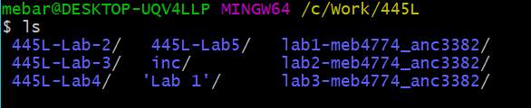

###### Changing Directories
Now that you have listed out the folders that you have access to, it is important to be able to navigate between them. If we want to change to a folder, we can use the “cd” command. The cd command has three main use cases. Additionally I will demonstrate how these instructions can be used:

1. You can type “cd ..” to go back one folder.
2. The cd C:Work/445L/445L-Lab5/ command will change my current folder to the 445L-Lab5.
3.  If the folder I want to go to is inside of my current folder I can say “cd 445L-Lab5” to change.

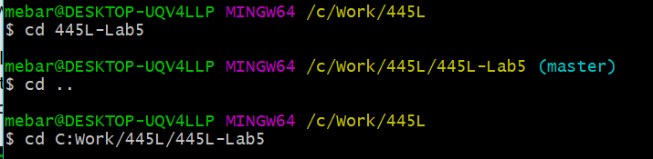
###### Creating Directories
Finally, you will want to create a new folder to work with. Navigate to the location that you want to work with and type “mkdir foldername”. This will create a new folder that you can navigate into and work with. Below is an example of a directory before and after a mkdir instruction.

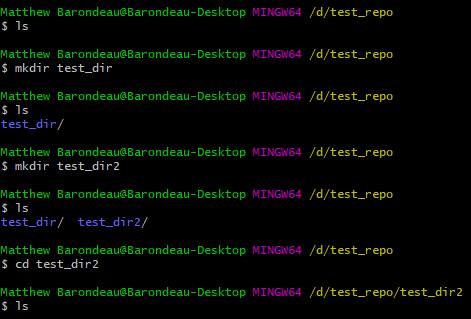

###### Removing Directories
In the event that you create a folder or document that you want to remove, there is a handy command to delete them. Of course, you could always navigate to the file directory and delete it normally, but this is cooler. To remove a file, type rm followed by the file name. An example of this is here:

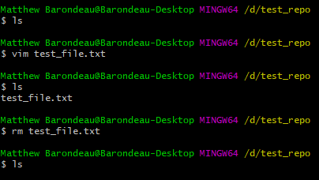

If you want to remove a folder, you can use "rm -r dirname" to remove a full directory. Anything that is write protected you have to manually select. So as usual, be careful when deleting stuff.

#### Git commands
This section shall cover some basic git functionality. I will explain how to use git specifically with Git Bash and normal git command line utilities.

###### git clone
The first idea covered here is cloning. That is, making a local copy of a repository that is stored up on GitHub or GitLab. This is normally the first step in the process of using git.

To start, you need to have a repository on GitHub or GitLab, and grab the HTTPs link. You need this link so that you can safely copy the code onto your machine. An example of finding the HTTPS link and cloning the repository is shown below.

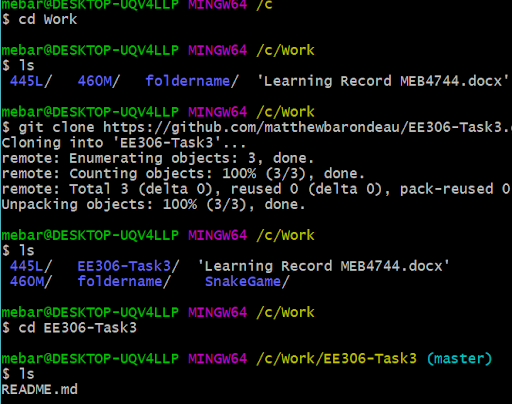

###### git status
So, now what? We have cloned a repository from GitHub, but we don't know what git is tracking or what is going on. A way to view what changes have been made or that git is tracking, is through the "git status" command. This command spits a lot of information at you. So I'm going to put a screen capture right below here, and then explain what is going on.

Alright so lets look at all these sections. First, up at the top, it tells us that we are up to date with the remote branch up on GitHub. If there were additional commits on our computer that weren't pushed up, or additional changes that we haven't pulled down, this will tell us.

Right below that is a section with some green letters in it. This is the contents of the staging area. As I mentioned above, these are the files that we want to add to a commit. In the commit process described below, these are the changes that will be saved.

Below the green area is the red area. These are the changes that happened in the directory, but that git is not currently tracking. We can move them to the staging area using the add comand below.

###### git add
Once you have cloned the repository, you can create your files or move them into this repository. At this point however, git is not tracking them. To tell git to begin tracking files, I will use the "git add filename" command. This command will add any file I name to the staging area that I mentioned earlier. If I want to add every file in the repository, I can use "git add ."

An example of git add is shown below:

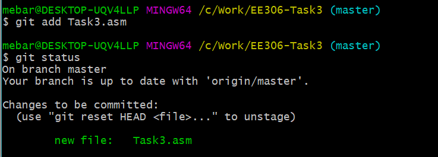

###### git commit
Alright, now we have finally reached the commit. Once we have added an item into the staging area using git add, we need to permanently save our changes. This is the commit process. The syntax is "git commit" which will commit everything in the staging area.

Now you will need to give a commit message describing what that commit changed. There are two ways to do this. The first is to use the commit command above and then a new window will pop up and you can type your message. Alternatively, you can use "git commit -m " and then type the message after the -m. An example is shown below.

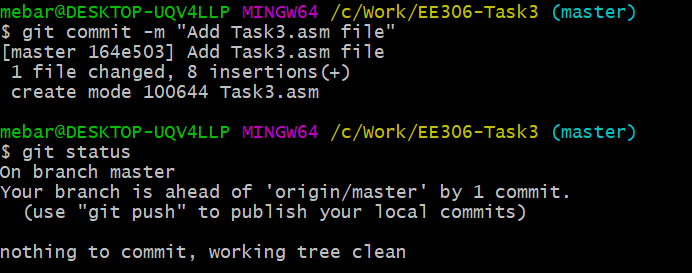

Please make sure you follow this excellent [commit guide](https://chris.beams.io/posts/git-commit/) on conventions and styles about making comments.

###### git log
Now that you have gone through the process of committing, you need to track your commits. The easiest way to do this is by using the log functionality. The syntax for this is "git log"
which will pull up the log. An example is shown below.

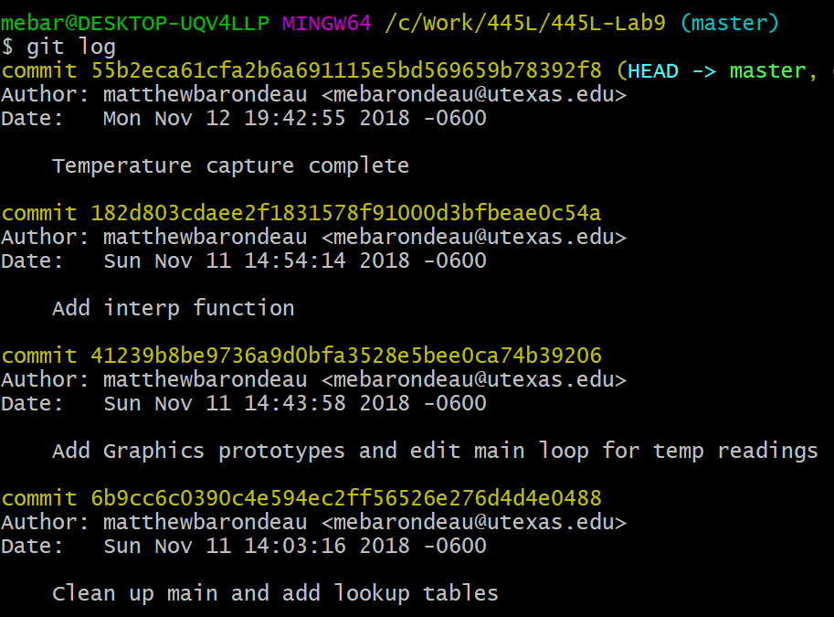

Here you can see the commit followed by an alphanumeric string. This string is the unique identifier for that commit. If you want to work with that commit in the future, use that string. Additionally, you can see the author, when it was committed and what the commit did.

###### git diff
Now that you have created some commits and viewed the log, it may be beneficial to find what changed between commits. Or more commonly, what your partner changed in their commits. This can be done using the diff command as shown below.

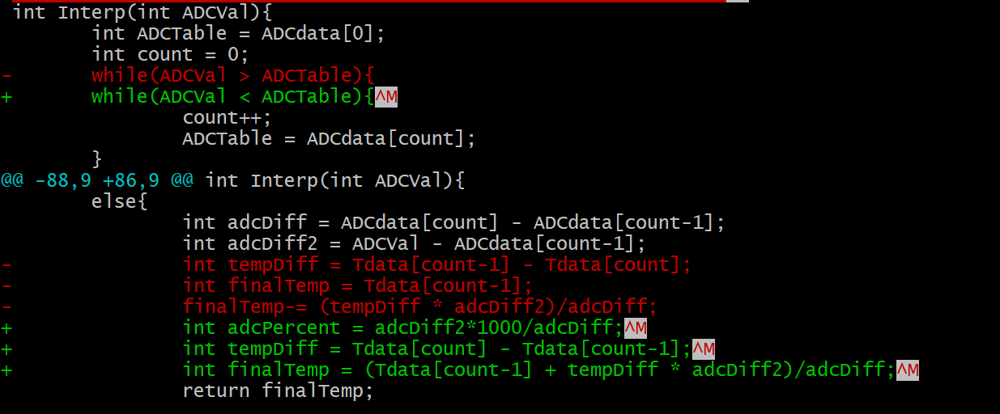

Shown in the example diff, where the removed text is in red and the new additions are green. You can also see new file additions using this command.

###### git pull
When coding in groups, you will need to keep track of changes made by other people and merge them into your own code. The first step in this process is pulling the code down to your computer from a repository. Before you pull any code, you need to make sure it is code that you want to fold into your system, and that any changes you made are either already saved or they don't matter.

If you want to save your code, refer to git stash as a way to temporarily store your changes. If there are changes that you don't want, refer to the git reset section on how to erase these changes. In either case, once you have decided your repository is ready to fold in some new information, you will use the "git pull" command. Note that this pulls from the online repository that you are connected to by default. If you want to pull from elsewhere, you will need to specify.

Here is an example of me pulling an update from GitHub:

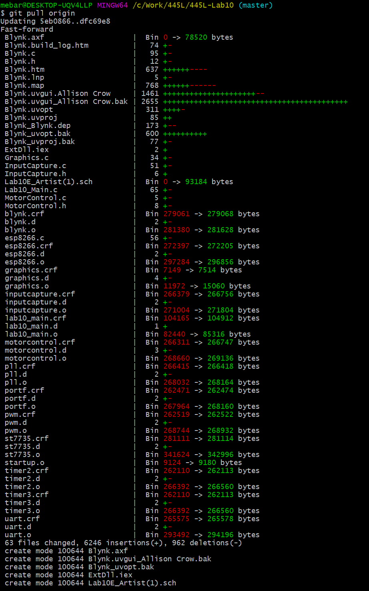

###### git push
Once you have made changes in your local repository, you can push this changes up to GitHub so that your partner can see your changes and so that if your laptop crashes, you have a backup of your code. As a reminder, git push comes after you have added a new commit. If you have not added a new commit, then you won't be able to push anything.

First, you should make sure that your local branch is up to date, this is done through the git pull command shown above. If your local repository is not up to date, git will not know what to do and you will get an error. After you have checked that your local repository is up to date, you will use the command "git push" and if you want a destination after it. This destination will be useful if you are working with branches as described below. For now, here is a screenshot depicting a successful push.

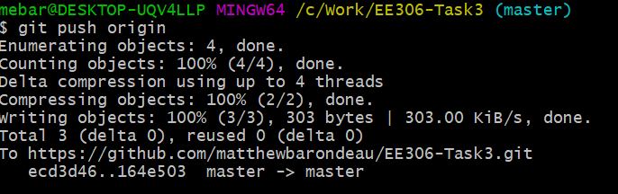

###### git branch
Git provides a feature that is useful for adding new features to code called a branch. If you are working on part of a project that has many disjoint parts, it may be useful to work on them separately and then merge them all together as they are completed. While this may be more useful as you work with larger projects, the concept is still worthwhile to go over. You can think of a branch as a separate sequence of commits that you will later merge back into your main master branch.

To begin, let me show you how to list out the branches. You can do this by typing "git branch" which will display all the current branches in your repository. An example is shown below:

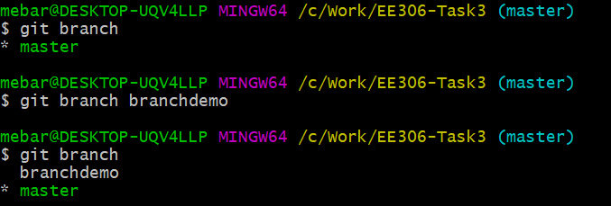

In this example above, I use git branch to display the list of current branches. If I want to create a new branch however, you need to be aware of 1 thing. The new branch I am creating will be a copy of the source branch, so if you want to modify your main program, make sure you are on the master branch when you create your new branch. In the example above, I use "git branch branchname" to create a new branch that is a copy of whatever branch I was on to begin this. This branch is denoted by green text. Now that you know what a branch is, I will describe how to change branches below using git checkout.

###### git checkout
Git checkout is the method by which a git user can select which branch they want to work on. The syntax is quite simplistic, as all you need to do is "git checkout branchname". Before you switch however, you need to make sure that your working directory is clean and that you don't have anything in your staging area that isn't committed. If you do not do this, git cannot switch and you shall get an error.

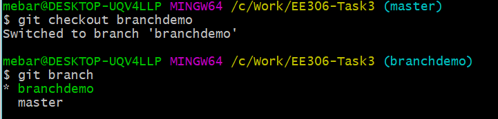

###### git reset
Now I get to come to the fun part of git. What happens when you make a mistake? Luckily, git provides three options for erasing your mistakes. These three options are all options for the git reset command. They are the hard, soft, and mixed. I will cover mixed and hard reset here as I find them the most useful.

First I will cover the mixed reset. This reset is useful because it will modify anything that we have added, but not yet committed yet, while leaving the local files the same. An example of this is if I stage a file but later change my mind about adding it this commit I can use the reset. If I type “git reset HEAD” git will reset everything in the staging area to a specific commit. This can also be used to wipe out local commits that haven’t been pushed yet.

The other type of reset is useful whenever you have really messed up and need to start from a point where you know your code worked. Be careful before you execute this command as it will wipe out any modifications to files you have made since that commit. The syntax is similar to the mixed reset. Now I have an example of reset down below, but I need to explain HEAD~1 first. This is a shorthand for the commit immediately before the one I was working on.

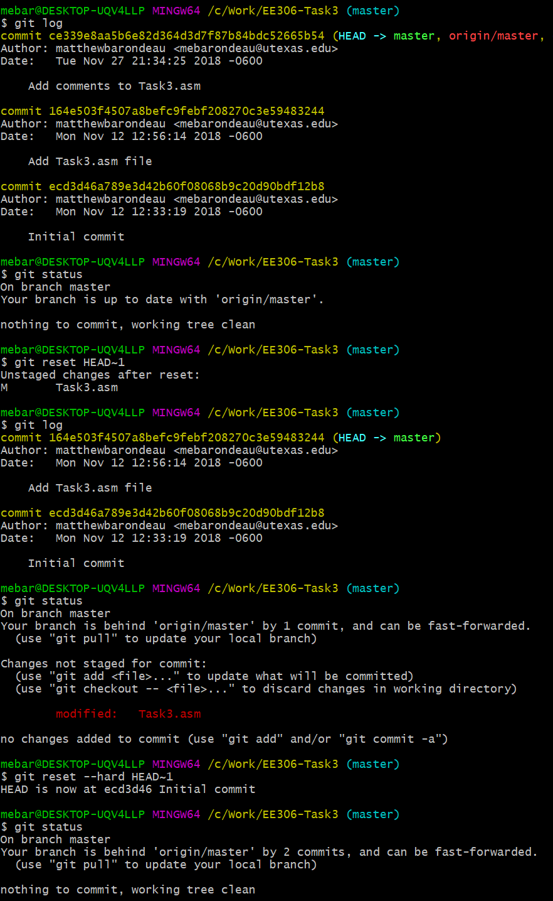

###### git blame
Ever been in a situation with a lab partner and you want to know whose fault a particular bug is? Luckily git thought ahead and there is a built in mechanism for assigning blame. This tool, called git blame, will go through a file and show who modified each line. An example of git blame is shown below. Additionally, on the far left, git blame will tell you the last commit that changed that line.

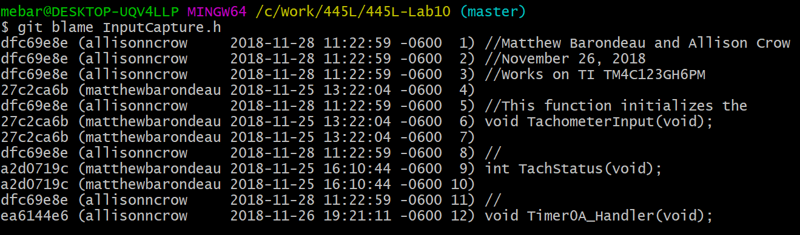

###### git stash
The final git feature that I will talk about is the git stash. Git stash is useful if you want to make a commit, but there is some file or change that is preventing you from committing, and you really care about that file or change. Git stash is a temporary storage area that you can write to and read from as you want. For more information, consult git documentation.

## Use with Keil
This section shall describe how to use git specifically with Keil projects. There will also be a section in which I show the process for adding files between Keil users and pulling them down.

### Example
The example shown here can be found at https://github.com/matthewbarondeau/GitExample

First, I am going to create a repository on GitHub for my first assignment. Then I am going to push the folder containing my project up to GitHub.

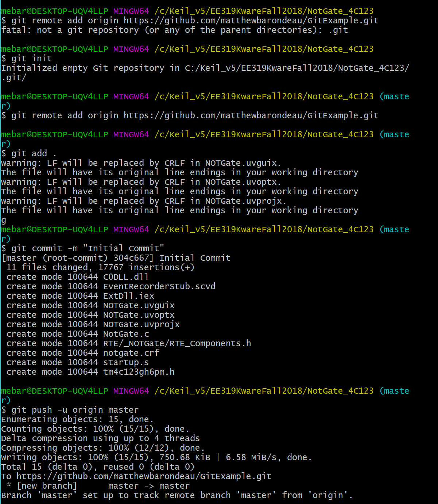

Now, I am going to make several changes and add a few files. The git log below shows my changes but if I wanted a more in depth view I could use git diff with the two commit ID's. An example here would be "git diff 304c667 cf4daa".

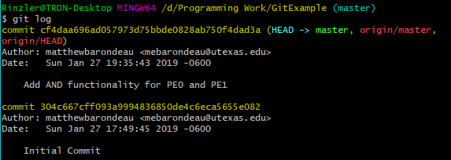

From here, I am going to pull this project onto a different computer. With Keil 5, you should be able to see any new files added to the project. If that is not the case, you can manually add them as shown below:

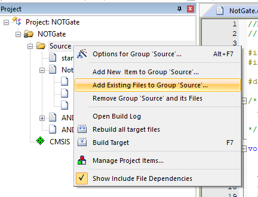

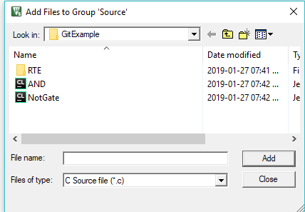

## Practice Exercises
This section shall describe additional practices and resources available if you want to explore git more.

### Basic Git Exercises

#### Exercise 1
In this exercise, you will learn how to clone and modify a repository individually. First, create a repository using GitHub. Once you have created the repository, clone it to your machine. Inside this repository, make a change to your data and commit the change. Push this change back up to the repository when you are done.

#### Exercise 2
In this exercise, you will use more of the version control aspect of git. Take the repository you created in exercise 1, and add several more commits. Adding around 3 commits will be the most useful. Once you have added these commits, pull up the git log. Inside the git log, revert your repository to the initial state before you added those new commits. This means clearing the staging area, commit history, and the file changes.

#### Exercise 3
In this exercise, you will focus on the collaborative functionality inherent in Git. Add a friend onto your Exercise 1 repository as a collaborator. Then, have them make a commit and push this commit up to GitHub or GitLab. Your job is then to pull their changes onto your computer without cloning the entire repository again.

### Intermediate Git Exercises

#### Exercise 1
In this exercise, you will work with branches. With your repository from the basic exercises, you will create a branch locally. Use Git Branch and Git checkout to switch to this branch. Make a change and add a commit on this branch. Now the really cool part. Switch back to your master branch and notice that the files in your directory no longer reflect the change on the branch. Cool stuff right?

#### Exercise 2
In this exercise, you will merge a branch into the master. Use your repository from the first exercise and switch to your branch. In this branch, add a couple of commits. This is coolest in exercise 3 if you have several commits. After you have added your changes in the branch, go back to the master and merge this branch in. If there is a merge conflict, try to resolve it. We will cover merge conflicts later on in the advanced section.

#### Exercise 3
In this exercise, we will use git to view changes to your repository and see any existing branches. Normally, we use Git Log to view changes, but it turns out there is a pretty useful graphical interface for this tool. This interface lets you know when branches are split and see how your code has been changing. In this exercise, you need to be on git Bash or in a terminal instance. Using your repository with the merged branch, pull up the graphical git log and see how the branch merges in.

### Advanced Git Exercises

#### Exercise 1
This exercise shall cover merge conflicts. You will need a partner for this exercise. You both need to have the same starting code. Clone the code onto the computers and make different commits and different changes. Both of you should push this code to your repository and you will have to handle the merge conflict.

#### Exercise 2
This exercise shall cover git blame. This fantastic tool is used whenever the code isn't working and you need someone to blame. Go to a project and have you and your partner edit a file and push it back to the GitHub repository. On your computer, run git blame and find out who did the most work on the project by the number of lines. See how great it is!?

## Extra Resources
This section shall detail some extra resources available to you when using Git.

#### GitHub Education
As a UT student, you can get access to GitHub Education in which you are given unlimited private repositories as you work on your projects. You will need to send in a picture of your UT EID in addition to signing up since you keep your UT email long after you graduate. The easiest way to get this benefit is to get the student pack on GitHub which can be located here: https://education.github.com/pack

#### GitHub Resources
For some very basic functionality, GitHub provides a tutorial. This tutorial is meant to interface specifically with their site, so if you plan on using other tools or something different, it probably won't be of as much use to you. The tutorial can be found here: https://guides.github.com/activities/hello-world/

#### Lynda Training Videos
Finally, if you decide that you absolutely adore Git and want to know even more about it, you are in luck. Lynda, which provides technical training videos, has several videos on how to use Git. These vieos are quite long and thorough so feel free to skip around. To access lynda, you should do the following:
1. Go to the following link and click the UT portal link.
2. Link: https://sites.utexas.edu/oe/ut-staff-professional-development/lynda-com-ut-portal/
3. The two videos that I have seen to be useful are "Git Essential Training" and "Git Intermediate Techniques". These videos total close to 9 hours of Git Training with accompanying exercises.
4. Link 1: https://www.lynda.com/Git-tutorials/Git-Essential-Training/100222-2.html?org=utexas.edu
5. Link 2: https://www.lynda.com/Git-tutorials/GIT-Intermediate-Techniques/664821-2.html?org=utexas.edu
